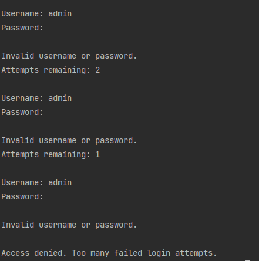

# Secure Login System

## Overview

This project demonstrates a secure login system using Python.

The program validates a username and password, stores passwords as salted hashes instead of plaintext, uses PBKDF2-HMAC-SHA256 with 600,000 iterations, compares password hashes using constant-time comparison, limits failed login attempts, and provides clear error messages.

It was created to practise authentication, access control, defensive programming, password hashing, brute-force resistance, and error handling.

## Skills Demonstrated

- Python scripting
- Authentication
- Access control
- Password hashing
- Salted password storage
- PBKDF2-HMAC-SHA256
- OWASP-aligned password hashing work factor
- Constant-time hash comparison using `hmac.compare_digest()`
- Login attempt limiting
- Error handling
- User input validation
- Security-focused documentation

## Security Relevance

Authentication is an important part of protecting systems and user accounts.

This project demonstrates how a login system can:

1. Avoid storing plaintext passwords
2. Store salted password hashes
3. Use PBKDF2-HMAC-SHA256 with 600,000 iterations
4. Compare password hashes using constant-time comparison
5. Reduce repeated failed login attempts
6. Avoid revealing whether the username or password was incorrect
7. Deny access after too many incorrect attempts
8. Handle unexpected input safely

## How The Program Works

The program:

1. Creates a sample user account
2. Hashes the password using PBKDF2-HMAC-SHA256 with a random salt
3. Uses 600,000 PBKDF2 iterations to make brute-force attempts more expensive
4. Stores only the salt and password hash
5. Asks the user to enter a username and password
6. Hashes the entered password using the stored salt
7. Compares the generated hash with the stored hash using `hmac.compare_digest()`
8. Allows a maximum number of failed login attempts
9. Shows a generic login failure message
10. Denies access after too many failed attempts

## Example Output

The screenshot below shows the failed login attempt limit in action. After three incorrect password attempts, access is denied.

## What I Learned

Through this project, I practised:

- Writing Python functions
- Using conditional logic
- Handling user input
- Creating basic authentication logic
- Hashing passwords instead of storing plaintext passwords
- Using salted password storage
- Comparing hashes safely with constant-time comparison
- Limiting failed login attempts
- Avoiding username and password enumeration clues
- Applying security thinking to code
- Explaining a technical project clearly

## Future Improvements

Future improvements could include:

- Password strength validation
- Account lockout timer
- Logging failed login attempts privately
- Reading users from a CSV file or database
- Adding a password reset function
- Adding multi-factor authentication simulation

## Author

Created and documented by Yalda as part of a cyber security and ICT portfolio.

## Disclaimer

This project is for learning and portfolio demonstration purposes only. It is not designed for production use.
