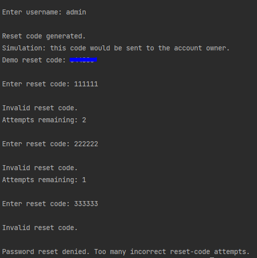

# Password Reset System

## Overview

This project demonstrates a password reset system using Python.

The program validates a username, generates a one-time reset code, verifies the reset code before allowing any password change, limits incorrect reset-code attempts, applies basic password strength checks, hashes the new password using PBKDF2-HMAC-SHA256, and updates the stored password hash.

It was created to practise password reset workflows, identity verification, password security, defensive programming, attempt limiting, and security-focused documentation.

## Skills Demonstrated

- Python scripting
- Password reset workflow
- User validation
- One-time reset code generation
- Identity verification simulation
- Secure token generation using `secrets`
- Reset-code attempt limiting
- Password strength checking
- Password hashing
- Salted password storage
- PBKDF2-HMAC-SHA256
- Error handling
- Security-focused documentation

## Security Relevance

Password reset functionality is an important part of account security.

A password reset system should not allow a password to be changed just because someone knows a username. The reset process must include a verification step to confirm that the person requesting the reset is authorised to change the password.

This project demonstrates how a password reset process can:

1. Check whether a user account exists
2. Generate a one-time reset code
3. Simulate sending the reset code to the account owner
4. Require the correct reset code before allowing a password change
5. Limit incorrect reset-code attempts
6. Avoid storing plaintext passwords
7. Hash new passwords before storage
8. Apply basic password strength rules
9. Provide clear but safe user messages

## How The Program Works

The program:

1. Creates a sample user account
2. Stores the user's password as a salted hash
3. Asks for a username
4. Checks whether the username exists
5. Generates a one-time reset code using Python's `secrets` module
6. Displays the reset code as a simulation of sending it to the account owner
7. Asks the user to enter the reset code
8. Allows a limited number of reset-code attempts
9. Stops the reset process if the reset code is entered incorrectly too many times
10. Verifies the reset code before allowing any password change
11. Asks the user to enter a new password
12. Checks whether the new password meets basic strength requirements
13. Hashes the new password using PBKDF2-HMAC-SHA256
14. Updates the stored salt and password hash
15. Confirms that the password reset was completed

## Example Output

The screenshot below shows the reset-code attempt limit in action. After three incorrect reset-code attempts, the password reset process is denied.

## Known Limitation

This project is a console-based learning simulation. The reset code is displayed in the console so the workflow can be tested.

In a production system, the reset code should not be displayed to the user in the same session. It should be delivered out-of-band, such as by email, authenticator app, or another verified channel. 

This helps prevent the reset process from revealing whether an account exists and provides stronger protection against account takeover.

## What I Learned

Through this project, I practised:

- Building a password reset workflow
- Validating user input
- Simulating identity verification before password reset
- Generating one-time reset codes
- Limiting reset-code attempts
- Applying basic password strength checks
- Hashing passwords instead of storing plaintext passwords
- Updating stored user credentials safely
- Writing clear security-focused documentation

## Future Improvements

Future improvements could include:

- Email-based reset code delivery
- Expiring reset codes
- Reset activity logging
- Account lockout after repeated failed reset sessions
- Privately logging password reset events
- Multi-factor authentication simulation
- Secure password reset links using URL-safe tokens

## Author

Created and documented by Yalda.

## Disclaimer

This project is for learning and portfolio demonstration purposes only. 
